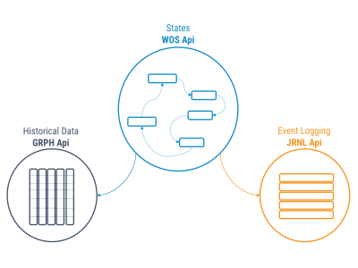

TP sur l'API des Produits WIT (4ème année d'Ingérieur en Batiments durables et intelligents)
====

Introduction à l'API du REDY
----

Le REDY embarque une API de type HTTP REST.

Depuis 2017, nos efforts s'orientent la transformation de cette API en une "Open API" dont voici une partie de la [Spécification](/assets/api/index.html)

Cette API est compatible avec les Authentifications

- OAUTH2 (Password)
- **Basic Auth (Authentification HTTP Simple)**

Fonctionnellement, Elle couvre les 3 concepts aux coeur de notre logiciel embarqués :

- Nos états, représentés par une structure arborescente dont chaque noeud porte une donnée. Cette donnée peut servir de
  - Configuration et Consigne.
  - Valeur (exemple: relevé d'une sonde)
- Des données historiques, issues de valeurs instantannées représentant un état du logiciel
- D'événements journalisés (ex: levée d'alerte)



Un REDY de démonstration est disponible à l'adresse http://openredy-demo.westeurope.cloudapp.azure.com.

Un utilisateur d'exploitation est configuré :
- Nom: _demo_
- mot de passe: _demo_

Travail
----

### 1. Première requêtes avec Postman

#### 1.1 Installation et configuration de Postman

- Installer l'utilitaire Postman depuis [https://www.getpostman.com/apps](https://www.getpostman.com/apps)
- Importer la définition de l'API depuis sa  [spécification OpenAPI](/assets/api/index.html) 
  - télécharger le fichier le fichier swagger
  - "Import" dans Postman
- Dans Postman La collection de requêtes "OpenREDY WOS Api" liste les opérations possibles


#### 1.2 Obtenir les classes d'objet avec Postman

- Ouvrir la liste des classes d'objet (Get Nod Classes)
  - Paramétrer l'authentification
  - Envoyer la requête et rechercher dans la structure JSON
  - Vérifier le statut de la réponse (200 Ok)
    - Une erreur d'authentification donne lieu à un code 410

#### 1.3 Rechercher les objets de type "Consigne Analogique"

- Dans la réponse précédente, recherche l'identifiant ("i") correspondant à la définition de classe "Consigne Analogique".
- Depuis les requêtes disponible dans la collection Postman, Composer une nouvelle requête pour recherche un objet ("Search Nods")
  - dans les paramètres requêtes, utiliser le filtre approprié pour rechercher toutes les Consignes Analogiques. (s'appuyer sur la [spécification]/assets/api/index.html#operation/wosSearch))


### 2. Modifier des variables avec **node-red**
----

#### 2.1 Installer node-red

- Installer Node.js ([LTS](https://nodejs.org/dist/v8.11.2/node-v8.11.2-x64.msi))
- Installer node-red
  - Depuis une invite de commande Administrateur
  ```cmd
  npm install -g --unsafe-perm node-red
  ```
  En cas de problème, Le Guide complet est disponible ici : https://nodered.org/docs/getting-started/installation


#### 2.2 Démarrer node-red

Lancer node-red depuis une invite de commande.
```
node-red
```
Accéder au [service](http://localhost:1880) node-red

#### 2.3 Obtenir la liste des ressources "Consigne Analogique"

- Sélectionner le chemin d'un objet récupéré en [1.3](#1.3 Rechercher les objets de type "Consigne Analogique")
- Commander le `SetPoint` de cette ressource et constater l'apparition de l'événement retraçant le changement de valeur dans cette [interface](http://appria.wit.fr/SynApps/#/http:%2F%2Fopenredy-demo.westeurope.cloudapp.azure.com/synapps/1479)

Un [exemple](http://openredy-demo.westeurope.cloudapp.azure.com:12255/#flow/10154d.e4c79ab3) d'implémentation de la partie `1.` est disponible.

Autres possibilités
----

Utiliser le [contrat swagger](https://app.swaggerhub.com/apis/WITSA/OPENREDY-API-DEMO/1.0) pour générer un client et utiliser sa technologie de prédilection.